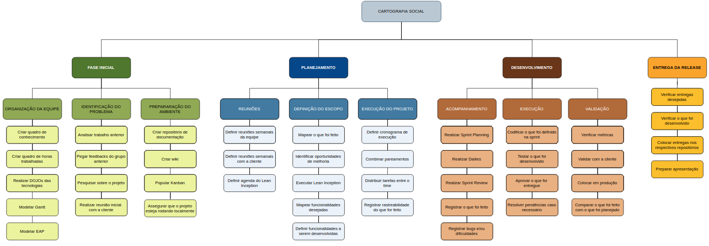
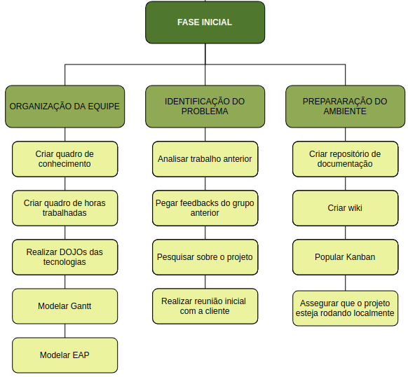
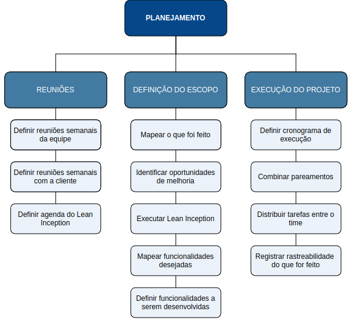

# 
Estrutura Analítica de Projetos

 
Uma Estrutura Analítica de Projetos (EAP) é a ferramenta primária para descrever o escopo do projeto. Ela consistem em um processo de subdivisão das entregas e do trabalho do projeto em componentes menores e mais facilmente gerenciáveis. É estruturada em árvore hierárquica, que decresce do mais geral para o mais específico, orientada às entregas, fases de ciclo de vida ou por entregáveis que precisam ser feitos para completar um projeto.
 
O objetivo de uma EAP é identificar elementos terminais, sejam eles produtos, serviços ou resultados, a serem feitos em um projeto. Assim, a EAP serve como base para a maior parte do planejamento de projeto. Neste projeto foi realizada uma EAP geral contendo as macro entregas ao longo do semestre.

<figcaption>

    <b>Figura 1 - EAP do projeto</b>
</figcaption>

[

](../../img/organizacao/eapGeral.png)

Para melhor visualização, cada etapa do EAP será mostrada separadamente a seguir.

<figcaption>

    <b>Figura 2 - EAP Fase Inicial</b>
</figcaption>

[

](../../img/organizacao/eapFaseInicial.png)

<figcaption>

    <b>Figura 3 - EAP Fase de Planejamento</b>
</figcaption>

[

](../../img/organizacao/eapPlanejamento.png)

<figcaption>

    <b>Figura 4 - EAP Fases de Desenvolvimento e Entrega da Release</b>
</figcaption>

[

](../../img/organizacao/eapDev.png)

### Histórico de versão

|Data | Versão | Descrição | Autor(es)
| -- | -- | -- | -- |
| 03.03.2022 | 1.0 | Criação do documento com EAP | Rafaella Junqueira |
