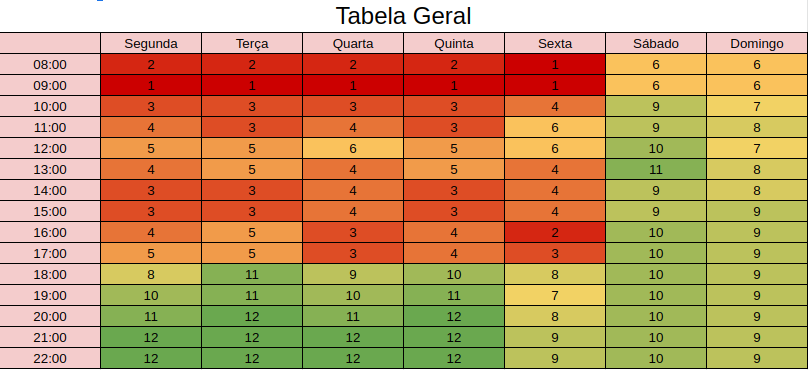

# 
 Heatmap

O Heatmap é um mapa de calor utilizado neste projeto serve para representar visualmente a disponibilidade dos integrantes durante a semana, assim, é possível otimizar o tempo disponível em conjunto para realizar reuniões e atividades que necessitam ser feitas em conjunto.
  
O quadro abaixo representa a disponibilidade de cada integrante para cada horário do dia, onde o número indica a quantidade de pessoas disponíveis naquele horário e as cores servem como um indicativo visual que variam entre vermelho (menor número de pessoas) e verde (maior número de pessoas). 

<figcaption>

    <b>Figura 1 - Quadro de disponibuilidade da equipe</b>
</figcaption>

[

](../../img/organizacao/heatmap.png)

## Histórico de versão

|Data | Versão | Descrição | Autor(es)
| -- | -- | -- | -- |
| 03.03.2022 | 1.0 | Criação do documento | Rafaella Junqueira |