# 
Cartografia Social

O porjeto Nova Cartografia Social tem o objetivo de promover o mapeamento social comunidades do bioma Amazônia e o fortalecimento da rede de pesquisa envolvida no projeto. O objetivo deste projeto é dar continuidade ao desenvolvimento e implementação de um aplicativo mobile, <a href="https://github.com/fga-eps-mds/2021.1-Cartografia-social-docs">iniciado em 2021.1</a>,  que funcione para auxiliar no mapeamento e registro de situações reais das comunidades, por meio da delimitação de áreas no mapa e marcação de pontos.

## Membros da equipe

    

        
Rafaella Junqueira
            <!-- <a href="https://github.com/RafaellaJunqueira">Rafaella Junqueira</a> -->
        

        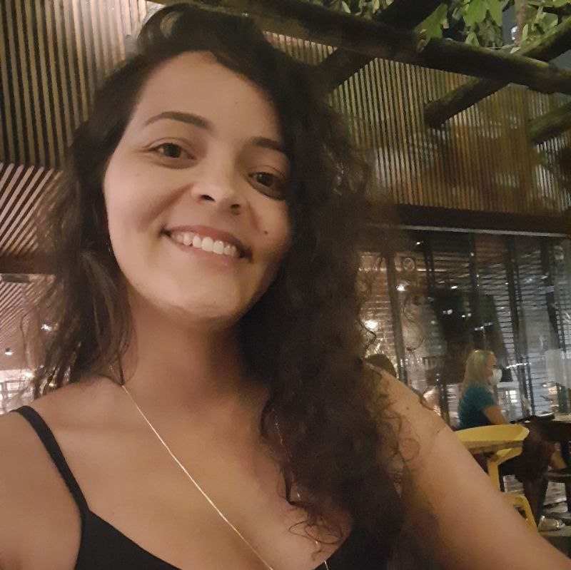
    

    

        
Marcos Nery

        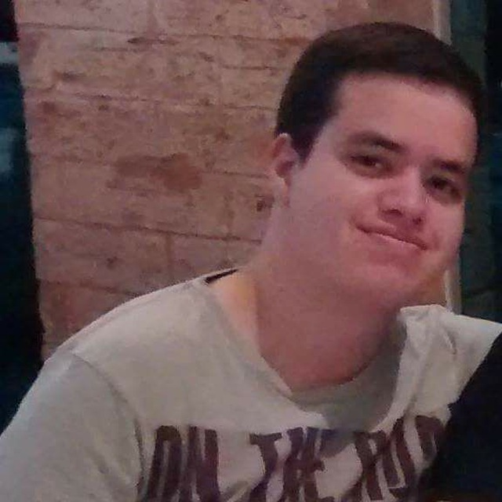
    

    

        
Gustavo Marques

        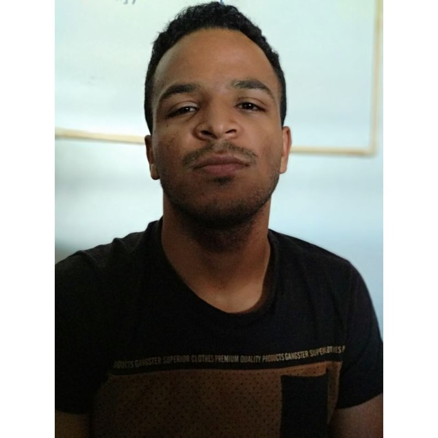
    

  

    
Larissa Sales

    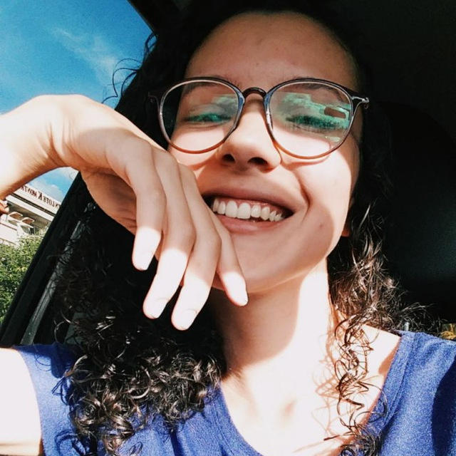
  

  

    

        
Pedro Vitor

        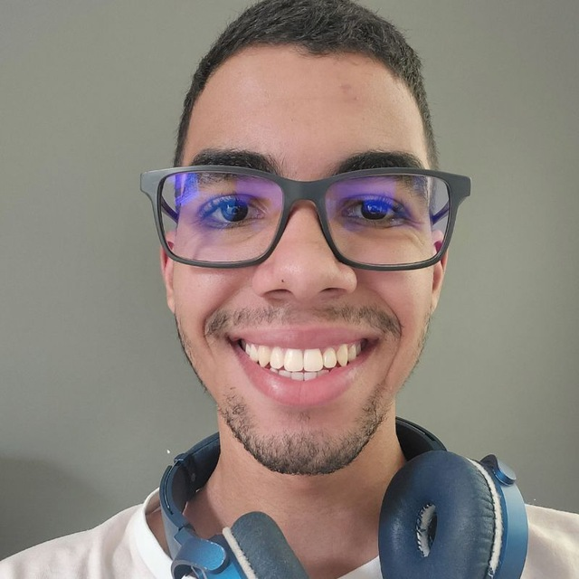
    

    

        
Eric Chagas

        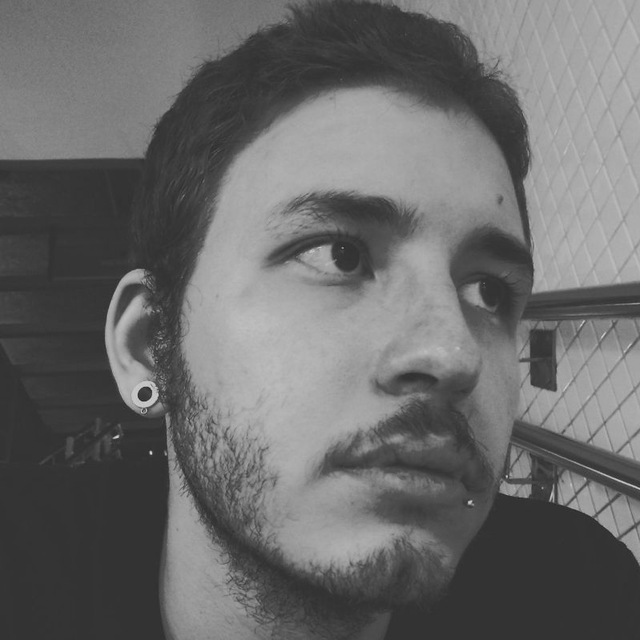
    

    

        
Gustavo Martins

        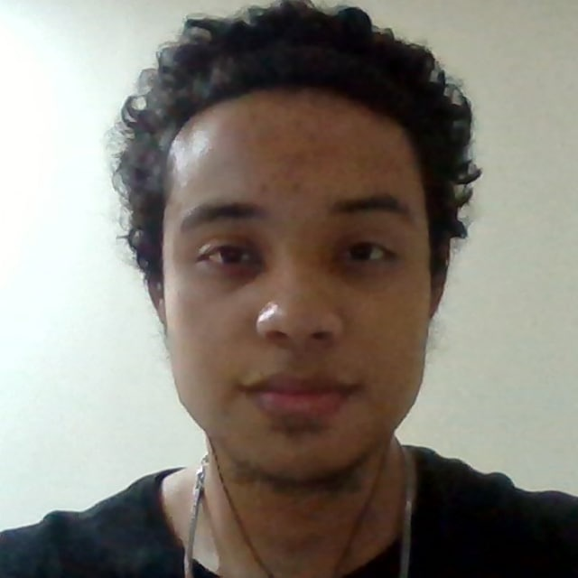
    

    

        
Vinícius Alves

        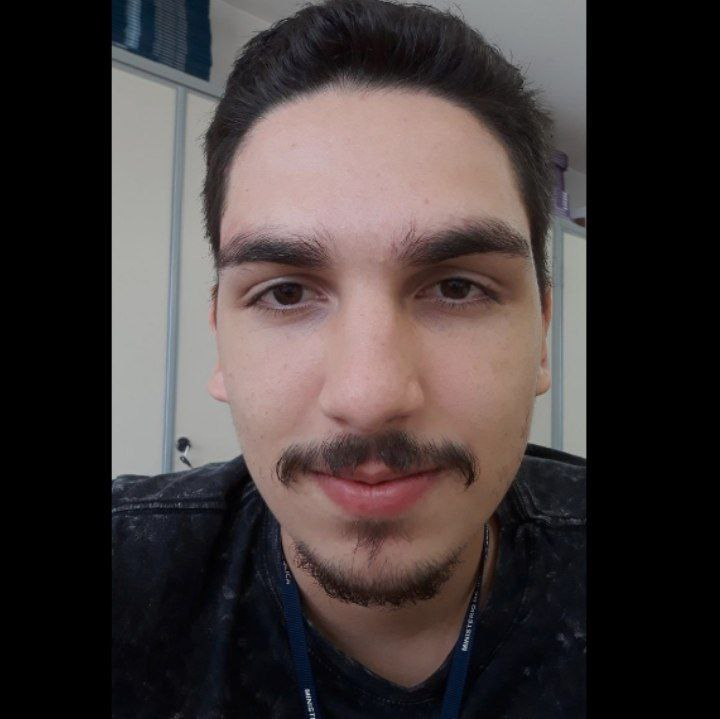
    

    

        
Israel Thalles

        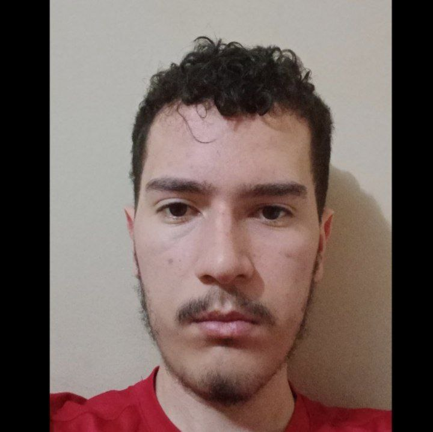
    

    

        
Gian Medeiros

        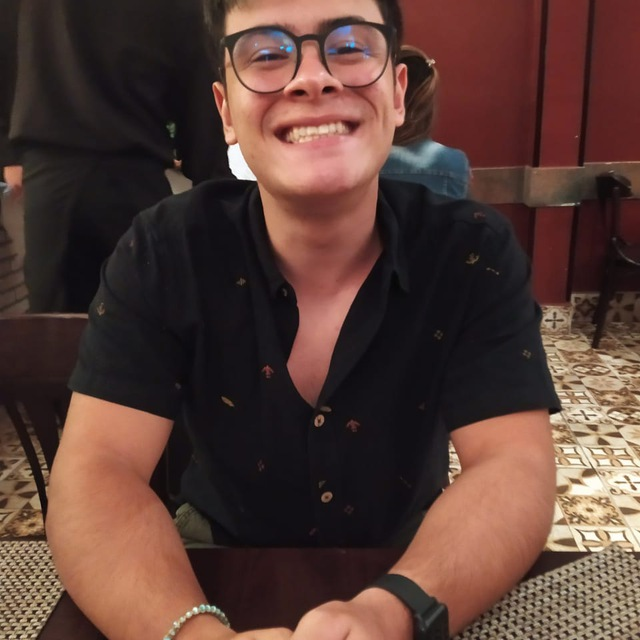
    

    

        
Gabriel Nascimento

        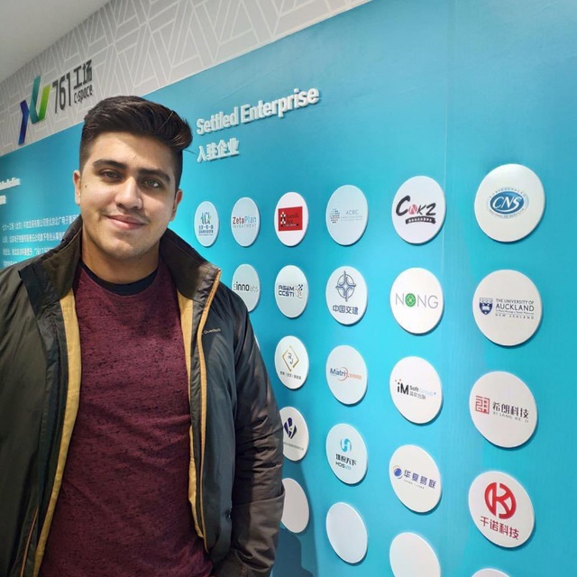
        <link></link>
    

    

        
    

