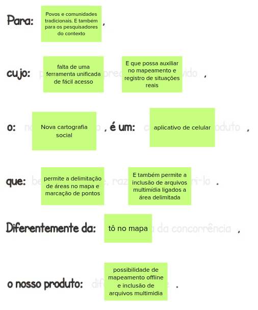
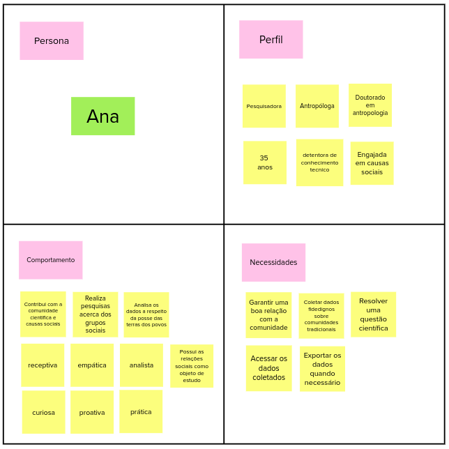
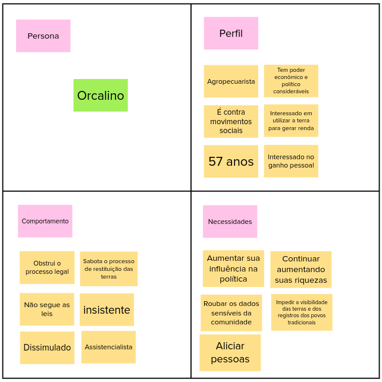
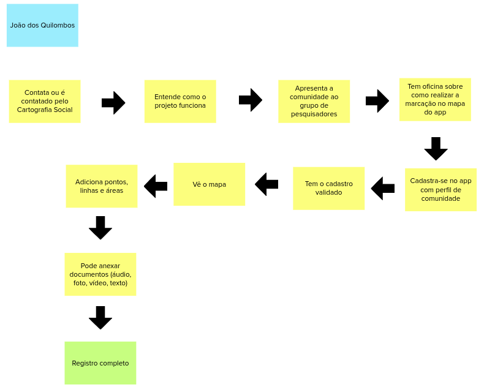
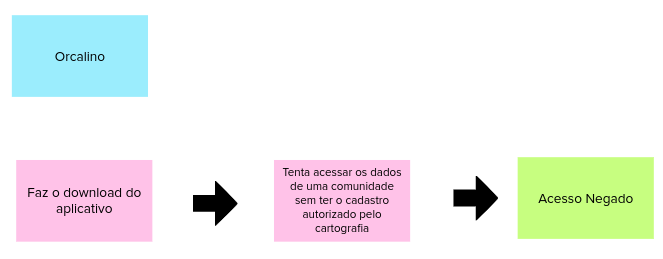
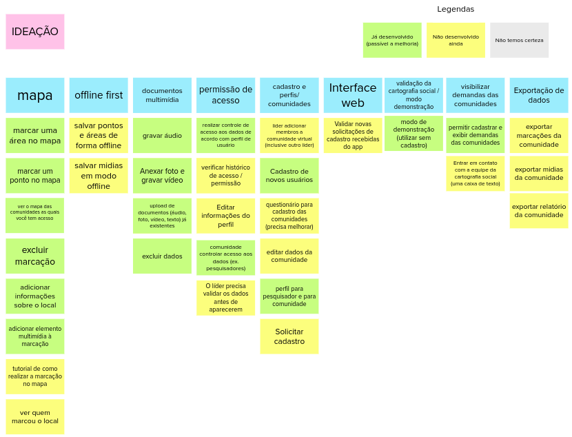
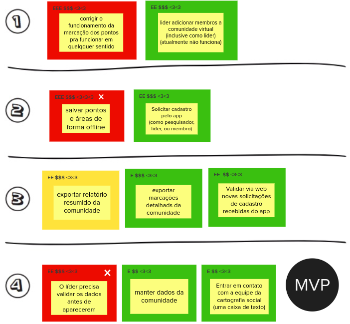
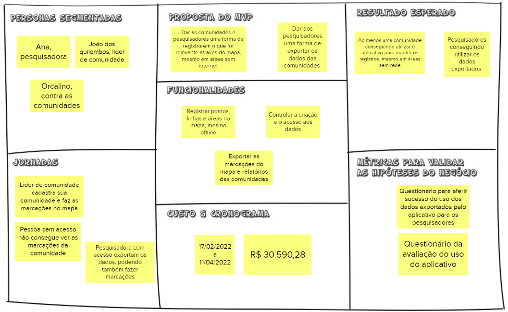

# 
Lean Inception

Lean Inception é um método cridao por Paulo Caroli para que a equipe de desenvolvimento obtenha o produto mínimo viável (MVP), ou seja, o mapeamento do que seria a versão mais simplificada de um produto e que pode ser lançada com uma quantidade mínima de esforço e desenvolvimento.
 
O objetivo deste método é alinhar o entendimento entre as áreas de negócio e as técnicas sobre um produto em seus aspectos mais fundamentais, isso por meio do seguinte fluxo: entender sobre o produto desejado, definir os objetivos de negócio, identificar os usuários finais e suas jornadas até o produto, mapear e priorizar funcionalidades, e definir as funcionalidades que farão parte do MVP. 
Após realizada toda a agenda do Lean Inception, este documento formaliza o resultado final de cada etapa e servirá como base teórica para o desenvolvimento do que foi proposto.

 

# 1. Visão do produto

A visão do produto ajuda a trilhar o caminho inicial entre a ideia e o lançamento do MVP. Ele ajuda a definir a visão do produto de modo colaborativo e definir a essência do valor de negócio, refletindo uma mensagem clara e convincente para os clientes.

 

<figcaption>

    <b>Figura 1 - Visão do Produto</b>
</figcaption>

[

](../../img/leanInception/visaoDoProduto.png)

# 2. "É/ Não é" e "Faz/ Não Faz"

Esta atividade ajuda a definir o produto de forma que, por vezes é mais fácil descrever algo pelo que tal coisa não é ou deixa de fazer. Tem o objetivo de transmitir aos envolvidos uma visão mais alinhada a respeito do que o produto faz, o que o produto não faz, o que ele é e o que não é.

 

<figcaption>

    <b>Figura 2 - Quadro "É/ Não é" , "Faz/ Não Faz"</b>
</figcaption>

[

](../../img/leanInception/fazNaoFaz.png)

# 3. Objetivos do produto

Esta atividade serve para auxiliar no levantamento e esclarecimento dos objetivos de acordo com os objetivos gerais do negócio.

 

<figcaption>

    <b>Figura 3 - Objetivos de negócio</b>
</figcaption>

[

](../../img/leanInception/objNegocios.png)

# 4. Personas

A criação de personas serve para representar um usuário do sistema, descrevendo o seu papel e suas necessidades específicas. Assim, é possíve identificar as funcionalidades do sistema por meio de representações de quem se espera obter como de usuários, auxiliando o time a descrever funcionalidades do ponto de vista de quem irá interagir com o produto final. 
 
Foram criadas 3 personas para este produto, conforme imagens a seguir: 

 

<figcaption>

    <b>Figura 4 - Persona 1 (pesquisadores)</b>
</figcaption>

[

](../../img/leanInception/persona1.png)

<figcaption>

    <b>Figura 5 - Persona 2 (integrante da comunidade)</b>
</figcaption>

[

](../../img/leanInception/persona2.png)

<figcaption>

    <b>Figura 6 - Persona 3 (usuário indesejado)</b>
</figcaption>

[

](../../img/leanInception/persona3.png)

# 5. Jornadas do usuário

A jornada descreve o percurso de um usuário por uma sequência de passos para alcançar um objetivo. Alguns destes passos representam diferentes pontos de contato com o produto, caracterizando a interação da pessoa com ele.

 

<figcaption>

    <b>Figura 7 - Jornada do usuário 1</b>
</figcaption>

[

](../../img/leanInception/jornada1.png)

<figcaption>

    <b>Figura 8 - Jornada do usuário 2</b>
</figcaption>

[

](../../img/leanInception/jornada3.png)

<figcaption>

    <b>Figura 9 - Jornada do usuário 3</b>
</figcaption>

[

](../../img/leanInception/jornada2.png)

# 6. Brainstorming de funcionalidades

Uma funcionalidade representa uma ação ou interação de um usuário com o produto. O brainstorming de funcionalidades,também chamada de tempestade de ideias, é uma técnica utilizada para propor soluções a um problema específico. Consiste em uma reunião na qual os participantes expõem suas sugestões e debatem sobre as contribuições do coletivo. No âmbito de software o brainstorming serve para que os participantes deem ideias de funcionalidades do produto.

 

<figcaption>

    <b>Figura 10 - Funcionalidades listadas</b>
</figcaption>

[

](../../img/leanInception/funcionalidades.png)

# 7. Revisão técnica, de negócio e de UX

Nesta atividade os participantes representam as funcionalidades do produto com suas cores e marcações indicando nível de incerteza, esforço e percepção de valor para o negócio e para os usuários, para que assim fique mais fácil de priorizar posteriormente.
 
A marcação de cada funcionalidade é dada a partir de um mapa de 2 eixos, onde o eixo y representa qual a clareza daquela funcionalidade no ponto de vista de négocios e o eixo x representa o conhecimento de como fazer aquela funcionalidade no ponto de vista de desenvolvimento.

 

<figcaption>

    <b>Figura 11 - Quadro de revisão UX</b>
</figcaption>

[

](../../img/leanInception/revisaoUX.png)

# 8. Sequenciador

O Sequenciador de funcionalidades auxilia na organização e visualização das funcionalidades e da sequência de validação incremental do produto. As ondas carregam as funcionalidades que serão desenvolvidas em ordem de priorização, seguindo as regras de:
<ul>
    <li> Regra 1: Uma onda pode conter no máximo três, cartões</li>
    <li> Regra 2: Uma onda não pode conter mais de uma cartão vermelho</li>
    <li> Regra 3: Uma onda não pode conter três cartões somente amarelos ou vermelho</li>
    <li> Regra 4: A soma de esforço dos cartões não pode ultrapassar cinco Es</li>
    <li> Regra 5: A soma de valor dos cartões não pode ser menos de quatro $s e quatro corações</li>
    <li> Regra 6: Se um cartão depende de outro, esse outro deve estar em alguma onda anterior</li>
</ul>

 

<figcaption>

    <b>Figura 12 - Sequenciador de funcionalidades do MVP e possíveis incrementos</b>
</figcaption>

[

](../../img/leanInception/mvp.png)
[

](../../img/leanInception/incremento.png)

# 9. Canvas MVP

O Canvas MVP é um quadro visual que auxilia a equipe a alinhar e definir a estratégia do MVP, a versão mais simples do produto que pode ser disponibilizada para o negócio (produto mínimo) e que possa ser efetivamente utilizado e validado pelo usuário final (produto viável).

 

<figcaption>

    <b>Figura 13 - Canvas MVP</b>
</figcaption>

[

](../../img/leanInception/canvas.png)

# MURAL

O MURAL completo e navegável contendo todas as etapas aqui descrita pode ser enalisado clicando sobre a imagem abaixo.

<figcaption>

    <b>Figura 14- MURAL completo</b>
</figcaption>

[

](https://app.mural.co/invitation/mural/unbfgaepsmds202111846/1644326822459?sender=ua4a5d97b99aa0006fa2a0546&key=b27666d4-fc69-4956-b5bc-db92c3f240d1)

## Referências

**CAROLI, Paulo**. _Lean Inception: como alinhar pessoas e construir o produto certo_, 2019.

### Histórico de versão

|Data | Versão | Descrição | Autor(es)
| -- | -- | -- | -- |
| 06.03.2022 | 1.0 | Adição do conteúdo produzido durante o processo de Lean Inception | Rafaella Junqueira |
| 10.03.2022 | 1.1 | Adição do direcionador ao MURAL do Lean Inception | Rafaella Junqueira |