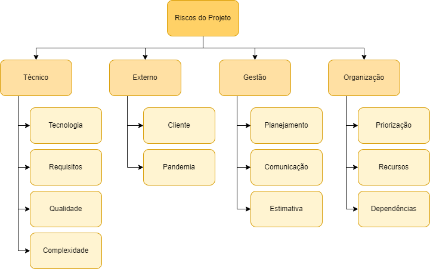

# 
 Plano de Gerenciamento de Riscos

## Introdução
O Plano de Gerenciamento de Riscos possibilita o entendimento de como ...

## Objetivo
O objetivo desse planejamento é documentar os riscos associados ao desenvolvimento do projeto e as ações que devem ser tomadas para que eles sejam reduzidos ou evitados.

## Estrutura Analítica dos Riscos
Uma forma comum para estruturar categorias dos riscos é através da EAR (Estrutura Analítica dos Riscos), que constiste em uma representação hierárquica de possíveis fontes de riscos. Uma EAR ajuda a equipe responsável pelo projeto a considerar toda as possíveis fontes das quais podem surgir cada um dos riscos do projeto.

<figcaption>

    <b>Figura 1 - EAR do projeto</b>
</figcaption>

[

](../../img/organizacao/ear.png)

### Riscos Técnicos

| Tipo | Descrição |
| -- | -- |
| Tecnologia | Riscos gerados a partir das tecnologias empregadas |
| Requisitos | Riscos gerados a partir da má elicitação dos requisitos |
| Qualidade | Riscos gerados a partir da baixa qualidade do produto final |
| Complexidade | Riscos gerados a partir da dificuldade de implementação por parte do time de desenvolvimento |

### Riscos Externos

| Tipo | Descrição |
| -- | -- |
| Cliente | Riscos gerados a partir das atividades relacionadas ao cliente, como mudança de escopo ou falta de validação das entregas |
| Pandemia | Riscos gerados a partir do cenário mundial atual de COVID-19 |

### Riscos de Gestao

| Tipo | Descrição |
| -- | -- |
| Planejamento | Riscos gerados a partir do mau planejamento durante o desenvolvimento do projeto |
| Comunicação | Riscos gerados a partir da comunicação não efetiva entre os as partes integrantes do projeto |
| Estimativa | Riscos gerados a partir do cronograma mal estruturado |

### Riscos da Organização

| Tipo | Descrição |
| -- | -- |
| Priorização | Riscos gerados a partir da priorização errada dos entregáveis |
| Recursos | Riscos gerados a partir do mau planejamento de custos |
| Dependências | Riscos gerados a partir da interação incorreta entre as possíveis variáveis necessárias para a entrega do projeto |

## Critérios

### Análise de Probabilidade

| Probabilidade |	Intervalo	| Peso |
| -- | -- | -- |
| Muito Baixa	| menor que 10%	| 1 | 
| Baixa	| de 10% a 25%	| 2 | 
| Média	| de 25% a 50% | 3 | 
| Alta | de 50% a 75% | 4 | 
| Muito Alta | maior que 75%	| 5 | 

### Análise de Impacto

| Impacto	| Descrição	| Peso |
| -- | -- | -- |
| Insignificante | Impacto insignificante para o andamento do projeto	| 1 |
| Pequeno	| Impacto com pouca influência no andamento do projeto | 2 |
| Moderado | Impacto notável para o andamento do projeto | 3 |
| Grande | Impacto grave para o andamento do projeto | 4 |
| Crítico	| Impacto crítico para o andamento do projeto	| 5 |

## Referências

TERLIZZI, Marco Alexandre & BIANCOLINO, César Augusto. Estrutura Analítica de Riscos em Projetos de Desenvolvimento de Software no Setor Bancário: Um Estudo Exploratório. **Revista Gestão & Tecnologia**, v. 14, n. 2, p. 51-78, mai./ago. 2014. Disponível em: <<http://revistagt.fpl.emnuvens.com.br/get/article/viewFile/628/534#:~:text=A%20EAR%20(Estrutura%20Anal%C3%ADtica%20de,gest%C3%A3o%20(Hillson%2C%202003)>>. Acesso em: 12 de mar de 2022.

ISOTANI, Seiji & ROCHA, Rafaela V. **Gestão de Riscos em Projetos de Software**. USP. Disponível em: <<https://edisciplinas.usp.br/pluginfile.php/3385127/mod_resource/content/1/Aula10-GerenciaProjeto-Riscos.pdf>>. Acesso em: 12 de mar de 2022.

JUNCKES, Gabriel Dias & MORGADO, Paulo. Gerência de riscos em desenvolvimento de software. **DEVMEDIA**, 2013. Disponível em: <<https://www.devmedia.com.br/gerencia-de-riscos-em-desenvolvimento-de-software/28506>>. Acesso em: 12 de mar de 2022.
## Histórico de versão

|Data | Versão | Descrição | Autor(es)
| -- | -- | -- | -- |
| 12.03.2022 | 1.0 | Criação do documento | Larissa Sales |

